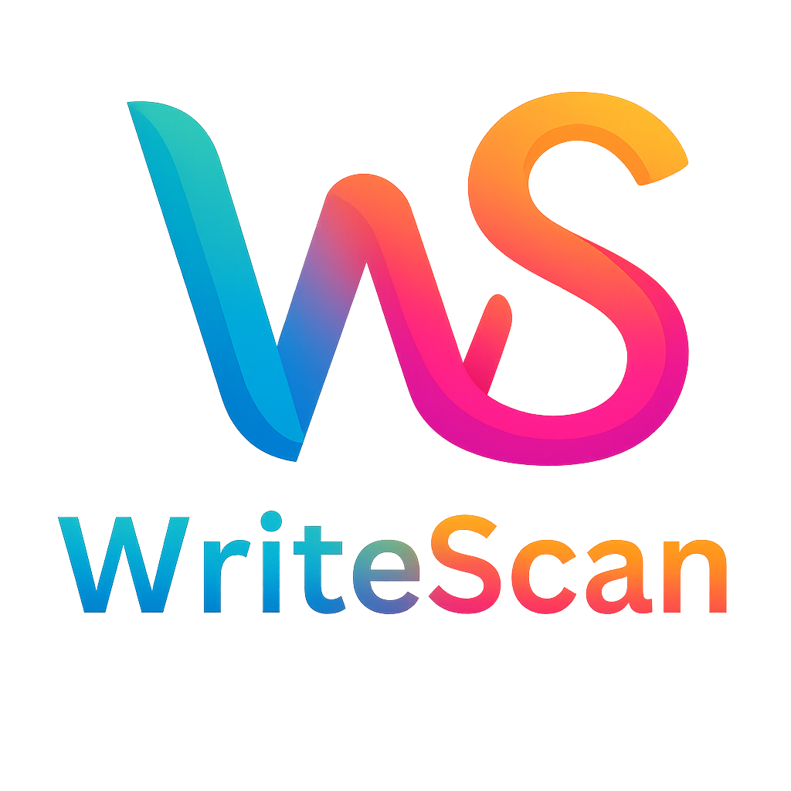

<p align="center">
  
</p>

<h1 align="center">WriteScan</h1>

<p align="center">
  <strong>AI-powered OCR that extracts structured, formatted text from handwritten and printed documents.</strong>
</p>

<p align="center">
  <a href="#features">Features</a> •
  <a href="#tech-stack">Tech Stack</a> •
  <a href="#architecture">Architecture</a> •
  <a href="#getting-started">Getting Started</a> •
  <a href="#environment-variables">Environment Variables</a> •
  <a href="#api-reference">API Reference</a> •
  <a href="#project-structure">Project Structure</a> •
  <a href="#deployment">Deployment</a>
</p>

---

## Overview

WriteScan is a modern web application that extracts text from handwritten notes, printed documents, PDFs, and images while **preserving the original document's structure and alignment**. It uses the Groq Vision API (Qwen 3.6) to intelligently interpret documents and outputs clean, faithful Markdown — maintaining headings, bullet points, numbered lists, tables, bold/italic text, centered/right-aligned content, and more.

Unlike simple OCR tools that dump flat plain text, WriteScan reproduces the document's visual hierarchy so the extracted text looks and reads like the original.

---

## Features

- **Multi-format support** — Upload PDFs (up to 20MB, 10 pages) or images (JPG, PNG, GIF, WebP, up to 4MB)
- **Structure-preserving extraction** — Headings, bullet lists, numbered lists, tables, bold/italic, underline
- **Alignment preservation** — Centered titles, right-aligned text, and left-aligned body are faithfully reproduced
- **Handwriting recognition** — AI-powered interpretation of handwritten documents
- **PDF page-by-page processing** — Each page is rendered to an image and OCR'd individually with collapsible page views
- **Rich Markdown rendering** — Extracted text is displayed as beautifully rendered Markdown with full GFM support
- **Search across results** — Filter extracted text across all pages instantly
- **Multiple export formats** — Download as Markdown (`.md`), JSON, or plain text
- **Copy to clipboard** — One-click copy per page with visual confirmation
- **Dark mode** — Toggle between light and dark themes with persistent preference
- **Responsive design** — Works on desktop, tablet, and mobile
- **Drag & drop upload** — Drop files directly onto the upload zone

---

## Tech Stack

| Layer | Technology | Purpose |
|-------|-----------|---------|
| **Framework** | [Next.js 16](https://nextjs.org/) (App Router, Turbopack) | Full-stack React framework |
| **Language** | TypeScript 5 | Type safety |
| **Styling** | Tailwind CSS 4 + custom CSS | Utility-first styling with design tokens |
| **UI Components** | Radix UI + shadcn/ui | Accessible, composable components |
| **Icons** | Lucide React | Clean, consistent iconography |
| **Markdown Rendering** | react-markdown + remark-gfm + rehype-raw | Render extracted text as formatted Markdown with HTML support |
| **PDF Processing** | pdfjs-dist (Mozilla PDF.js) | Parse and render PDF pages server-side |
| **Canvas Rendering** | @napi-rs/canvas | Server-side canvas for PDF page → image conversion |
| **AI / OCR Engine** | Groq API (Qwen 3.6 27B) | Vision-language model for text extraction |
| **Fonts** | Geist Sans + Geist Mono | Modern, clean typography |

---

## Architecture

```
┌─────────────────────────────────────────────────────────┐
│                     Browser (Client)                     │
│                                                          │
│  ┌──────────────┐  ┌───────────────┐  ┌──────────────┐  │
│  │  Upload Area  │  │ Results View  │  │  Dark Mode   │  │
│  │  (drag/drop)  │  │  (Markdown)   │  │  Toggle      │  │
│  └──────┬───────┘  └───────▲───────┘  └──────────────┘  │
│         │                  │                             │
│         │    POST /api/ocr │                             │
└─────────┼──────────────────┼─────────────────────────────┘
          │                  │
          ▼                  │
┌─────────────────────────────────────────────────────────┐
│                  Next.js API Route                       │
│                  (app/api/ocr/route.ts)                   │
│                                                          │
│  1. Receive file (image or PDF)                          │
│  2. If PDF → render each page to PNG via pdfjs + canvas  │
│  3. Convert image(s) to base64                           │
│  4. Send to Groq Vision API with structure prompt         │
│  5. Return Markdown text per page                        │
└──────────────────────┬──────────────────────────────────┘
                       │
                       ▼
            ┌─────────────────────┐
            │   Groq Vision API   │
            │   (Qwen 3.6 27B)    │
            │                     │
            │  Image → Markdown   │
            │  with alignment     │
            └─────────────────────┘
```

### How it works

1. **Upload** — User drops or selects a PDF/image file
2. **Pre-processing** — For PDFs, each page is rendered to a PNG image at 1.5× scale using `pdfjs-dist` and `@napi-rs/canvas` (server-side, no browser canvas needed)
3. **OCR** — Each image is base64-encoded and sent to the Groq API with a detailed prompt that instructs the model to:
   - Extract all text exactly as written
   - Use Markdown for structure (headings, lists, tables, bold, italic)
   - Use inline HTML `<div align="center">` / `<div align="right">` for alignment preservation
4. **Rendering** — The returned Markdown is rendered client-side via `react-markdown` with `remark-gfm` (tables, strikethrough) and `rehype-raw` (inline HTML alignment divs)
5. **Export** — Users can download results as `.md`, `.json`, or `.txt`

---

## Getting Started

### Prerequisites

- **Node.js** 18.17 or later
- **npm** (comes with Node.js)
- A **Groq API key** — get one free at [console.groq.com](https://console.groq.com/)

### Installation

```bash
# 1. Clone the repository
git clone https://github.com/princenogia/WriteScan.git
cd WriteScan

# 2. Install dependencies
npm install

# 3. Create your environment file
cp .env.example .env
# Or manually create .env and add your key (see below)

# 4. Start the development server
npm run dev
```

The app will be running at **http://localhost:3000**.

### Build for Production

```bash
npm run build
npm start
```

---

## Environment Variables

Create a `.env` file in the project root:

```env
GROQ_API_KEY=your_groq_api_key_here
# Optional: defaults to qwen/qwen3.6-27b
GROQ_OCR_MODEL=qwen/qwen3.6-27b
```

| Variable | Required | Description |
|----------|----------|-------------|
| `GROQ_API_KEY` | ✅ Yes | Your Groq API key. Get one at [console.groq.com](https://console.groq.com/) |
| `GROQ_OCR_MODEL` | No | Groq vision model to use. Defaults to `qwen/qwen3.6-27b`. |

> **Note:** The `.env` file is gitignored and will not be committed to the repository.

---

## API Reference

### `POST /api/ocr`

Extract text from an uploaded file.

**Request:**
- Content-Type: `multipart/form-data`
- Body: `file` — a PDF or image file

**Supported file types:**
| Type | Extensions | Max Size |
|------|-----------|----------|
| Images | `.jpg`, `.jpeg`, `.png`, `.gif`, `.webp` | 4 MB |
| PDF | `.pdf` | 20 MB (up to 10 pages) |

**Response (200):**

```json
{
  "results": [
    {
      "page": 1,
      "markdown": "# Document Title\n\nThis is the extracted text in **Markdown** format.\n\n- Bullet point one\n- Bullet point two\n\n| Column A | Column B |\n|----------|----------|\n| Data 1   | Data 2   |"
    },
    {
      "page": 2,
      "markdown": "## Page 2 Content\n\nMore extracted text..."
    }
  ]
}
```

**Error Responses:**

| Status | Description |
|--------|-------------|
| `400` | No file provided or unsupported file type |
| `429` | Groq API rate limit exceeded |
| `500` | Server error or missing API key |

---

## Project Structure

```
WriteScan/
├── app/
│   ├── api/
│   │   └── ocr/
│   │       └── route.ts          # OCR API endpoint (PDF processing + Groq Vision)
│   ├── globals.css               # Global styles, design tokens, OCR content styles
│   ├── layout.tsx                # Root layout with metadata and fonts
│   ├── page.tsx                  # Main page (upload UI + results view)
│   ├── favicon.ico               # App favicon
│   └── icon.png                  # App icon
│
├── components/
│   ├── ui/                       # shadcn/ui base components (Button, Card, Input)
│   ├── upload-area.tsx           # Drag-and-drop file upload component
│   └── results-display.tsx       # Markdown-rendered OCR results with search & export
│
├── lib/
│   └── utils.ts                  # Utility functions (cn class merger)
│
├── public/
│   ├── logo.png                  # WriteScan logo
│   ├── favicon.ico               # Browser favicon
│   └── favicon.png               # PNG favicon
│
├── .env                          # Environment variables (gitignored)
├── .gitignore                    # Git ignore rules
├── components.json               # shadcn/ui configuration
├── eslint.config.mjs             # ESLint configuration
├── next.config.ts                # Next.js configuration (external packages)
├── package.json                  # Dependencies and scripts
├── postcss.config.mjs            # PostCSS configuration (Tailwind CSS)
├── tsconfig.json                 # TypeScript configuration
└── README.md                     # This file
```

---

## Key Design Decisions

### Why Groq + Qwen 3.6?

Groq provides extremely fast inference for vision-language models. Qwen 3.6 27B handles both printed and handwritten text well, and the free tier offers generous rate limits for development and light usage.

### Why server-side PDF rendering?

PDFs are rendered to images on the server using `pdfjs-dist` + `@napi-rs/canvas` rather than sending raw PDF bytes to the vision API. This approach:
- Gives control over rendering quality (1.5× scale)
- Supports any PDF regardless of encoding
- Allows page-by-page processing with progress tracking

### Why Markdown output instead of structured JSON blocks?

Markdown naturally represents document structure (headings, lists, tables, emphasis) and is trivially renderable. It also allows the LLM to express alignment via inline HTML, which would be cumbersome with rigid JSON schemas.

---

## Scripts

| Command | Description |
|---------|-------------|
| `npm run dev` | Start development server with Turbopack |
| `npm run build` | Create optimized production build |
| `npm start` | Start production server |
| `npm run lint` | Run ESLint |

---

## Deployment

### Vercel (Recommended)

1. Push your code to GitHub
2. Import the repo at [vercel.com/new](https://vercel.com/new)
3. Add the `GROQ_API_KEY` environment variable in project settings
4. Deploy

> **Important:** The `@napi-rs/canvas` package requires a Node.js runtime. Make sure your Vercel project uses the **Node.js runtime** (not Edge) for the `/api/ocr` route. This is already configured via `serverExternalPackages` in `next.config.ts`.

### Docker

```dockerfile
FROM node:20-alpine
WORKDIR /app
COPY package*.json ./
RUN npm ci
COPY . .
RUN npm run build
EXPOSE 3000
CMD ["npm", "start"]
```

### Self-hosted

```bash
git clone https://github.com/princenogia/WriteScan.git
cd WriteScan
npm ci
echo "GROQ_API_KEY=your_key_here" > .env
npm run build
npm start
```

---

## License

This project is private. All rights reserved.

---

<p align="center">
  Built with ❤️ using Next.js, Groq AI, and Tailwind CSS
</p>
